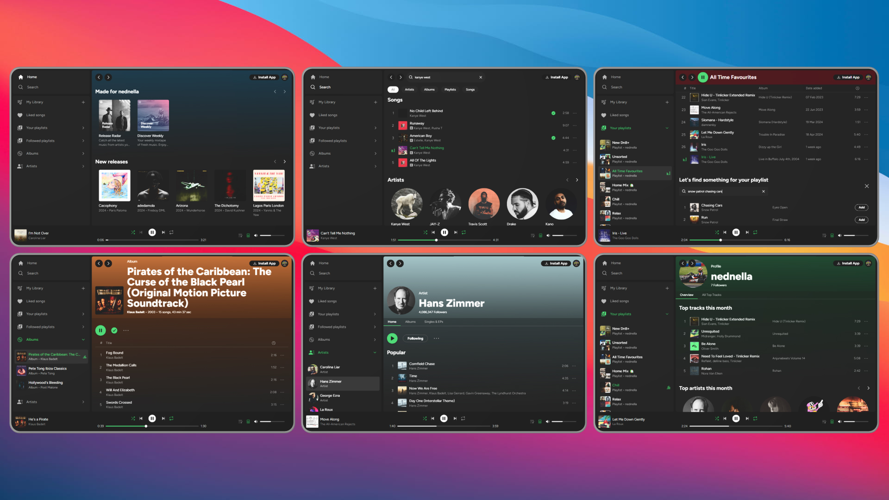
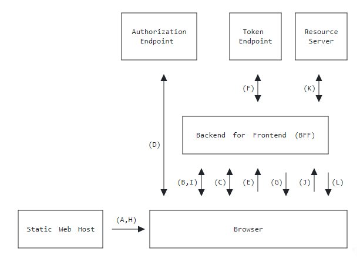

<div align='center'>
<h3><b>Spotify Web Player Clone</b></h3>
  <p>
    A custom Spotify client built with the Spotify Web API and Playback SDK
  </p>
  <p>
    <a href='https://www.youtube.com/watch?v=70G7YDejWG0' target='_blank' rel="noopener noreferrer">Video Demo</a>
  </p>
</div>

<br>



<div align='center'>
  
  
  
  
  
  

</div>

## Table of Contents

-   [Description](#description)
-   [Installation](#installation)
-   [Dependencies](#dependencies)
-   [Motivation](#motivation)
-   [Architecture](#architecture)
-   [Improvements](#improvements)
-   [Finishing Up](#finishing-up)
-   [References](#references)

## Description

This is my first full-stack application, featuring a React front-end written in TypeScript and built with Vite, supported by a Node Express server written in JavaScript.

This repository contains the front-end portion of the project, intended to work alongside an [auth/api server](https://github.com/nednella/spotify-server).

## Installation

1. Clone the repository

```sh
git clone git@github.com:nednella/spotify-client.git
```

2. Navigate to the cloned repository and install the dependencies

```sh
npm install
```

3. Run the application locally

```sh
npm run dev
```

You will also need to follow the installation instructions for the server, [found here](https://github.com/nednella/spotify-server).

## Dependencies

-   [Zustand](https://github.com/pmndrs/zustand) for handling client-side state
-   [React Query](https://github.com/TanStack/query) for handling server-side state
-   [Axios](https://github.com/axios/axios) for handling client-server communication
-   [Tailwind](https://github.com/tailwindlabs/tailwindcss) for component styling
-   [Radix UI](https://github.com/radix-ui) for complex UI components
-   [Embla Carousel](https://github.com/davidjerleke/embla-carousel) for carousel components, filling a gap in Radix's current offering

## Motivation

I have worked on numerous common learning development projects, while valuable, often felt repetitive and boring. Prior to this project, I hadn't yet used a modern front-end framework or handled server-side web API hosting.

I'm a long-time Spotify user, and have known about Spotify's [Web API](https://developer.spotify.com/documentation/web-api) and [Web Playback SDK](https://developer.spotify.com/documentation/web-playback-sdk) offerings for a while now. Ever since, there has been a long-term goal of writing my own clone from scratch, so here we are!

### Learning Objectives

-   Build a solid understanding of the React framework.
-   Develop general understanding of writing and running servers to support front-end clients.
-   Gain experience with TypeScript, with a long-term goal of aiming to replace plain JavaScript entirely.

## Architecture

The project began with extensive research into modern full-stack web application architectures, particularly concerning client authentication and sessions. Given that Spotify's API uses the OAuth2.0 framework for authorisation, I explored application architecture patterns designed for this purpose.

### Architecture Pattern

After reviewing various [OAuth architecture patterns](https://datatracker.ietf.org/doc/html/draft-ietf-oauth-browser-based-apps#name-application-architecture-pa), I elected to follow the [Backend For Frontend (BFF)](https://datatracker.ietf.org/doc/html/draft-ietf-oauth-browser-based-apps#name-backend-for-frontend-bff) pattern, as it best aligned with the goals of my project. In hindsight, this was not the optimal choice. More on that later.

With this pattern in mind, I would require a backend to act as an intermediary for all OAuth and API interactions between the client and Spotify's resouces. For some reason, I opted to build the project as a polyrepo, so you can find the backend [here](https://github.com/nednella/spotify-server).

<div align='center'>

  
</div>

### Authorisation Flow

The Spotify Web API offers [numerous authorisation flows](https://developer.spotify.com/documentation/web-api/concepts/authorization) udner the the **OAuth2.0** framework. These cover various application types, from long-standing server applications to SPAs running in the browser. As this project is a full-stack application, the [authorisation code flow](https://developer.spotify.com/documentation/web-api/tutorials/code-flow) was used to handle user authentication across the app.


### Session Management

The BFF pattern should rely on browser cookies (see: [Cookie-based Session Management](https://datatracker.ietf.org/doc/html/draft-ietf-oauth-browser-based-apps#name-cookie-based-session-manage)) for tracking user sessions within the client.

I initially envisioned a server hosted by a service provider to manage client sessions for individual users, so elected to use server-based cookie sessions via the [express-session](https://github.com/expressjs/session) middleware package. This approach would enable me to fine-tune cookie security and session storage. For testing and development, I could use the default MemoryStore instance, and easily connect to a third-party database for production.

I quickly discovered that if I wanted to host both client and server publicly, I would require an [extension request](https://developer.spotify.com/documentation/web-api/concepts/quota-modes) on my Spotify Application via the [Spotify Developer Dashboard](https://developer.spotify.com/dashboard). However, reviewing their [developer policy](https://developer.spotify.com/policy) revealed that replicating their web service and storing user auth tokens in a third-party database is not permitted.

As a result, the application was designed for local hosting only, but still using the same secure server-based cookie mechanism outlined above, with the [recommended cookie security](https://datatracker.ietf.org/doc/html/draft-ietf-oauth-browser-based-apps#name-cookie-security).

### The Result

1. The user begins the authorisation flow by signing in via the Spotify authentication redirect and grants access to the application for the requested resources (presented as authorisation scopes).

2. The sign-in page redirects the user back to the client, providing the client with an authorisation code.

3. The client sends the authorisation code to the backend, where the backend acts as an intermediary and sends a request containing the code to Spotify's auth token endpoint.

4. On success, the endpoint returns a response with the relevant token data.

5. The token information is stored within the session store on the server, and a secure cookie containing a session ID is sent to the client's browser, enabling the client to present a "logged in" state.

6. On subsequent API requests, the client automatically sends the cookie, which is first checked for validity via a session auth middleware, then checked for token expiry via a follow-up middleware. Finally, the token is sent along with any additional relevant information to the relevant Spotify API endpoint, and data (if applicable) is returned to the client.

### In Hindsight

In hindsight, I should have used the [Token-Mediating Backend](https://datatracker.ietf.org/doc/html/draft-ietf-oauth-browser-based-apps#name-token-mediating-backend) architecture for the project.

Although the BFF implementation was effective for bundling multiple streams of data into one response (e.g., when visiting an artist's page, the backend sends requests multiple resources in parallel, and then responds to the client request with 1. Artist information, 2. Aritst's top tracks, 3. Artist's singles & albums, 4. Related artists), it became rather cumbersome when dealing with paginated data.

Spotify's API is fantastic and provides easy-to-use paginated data from their endpoints. It provides easy-access URLs to send subsequent requests to for neighbouring pages, which work best without a mediary intercepting every request. An example of their paginated data looks like the following:

```js
{
  "href": "https://api.spotify.com/v1/me/shows?offset=20&limit=20",
  "limit": 20,
  "next": "https://api.spotify.com/v1/me/shows?offset=0&limit=20",
  "offset": 0,
  "previous": "https://api.spotify.com/v1/me/shows?offset=401&limit=20",
  "total": 100,
  "items": [...]
}
```

Thus, it would make sense to continue using a backend to handle authentication and sessions for security (which worked well for this project), but provide direct access to Spotify's resource servers from the client for follow-up requests.

Given that this project is only intended for local hosting, following the [Browser-based OAuth2.0 Client](https://datatracker.ietf.org/doc/html/draft-ietf-oauth-browser-based-apps#name-browser-based-oauth-20-clie) architecture might be most appropriate, since browser security is not a concern.

As an additional note, I should have also designed this project as a monorepo. it would have been much more convenient, and I didn't actually benefit in any way from setting it up as a polyrepo, other than enabling me to separate my Git work flows. Branches could have sufficed!

Nonetheless, it was an extremely fun application architecure learning curve, and I learned to handle multiple hiccups and unexpected changes of direction along the way.

## Improvements

Given that this is my first full-stack application, and my first time using React, there are plenty of improvements that can be made for next time (I will definitely revisit this one!).

The project was very much a learn-on-the-job vibe for me. Whenever a new problem arose, I researched best practices to tackle them and implemented solutions where possible. For exmaple, integrating React Query (RQ) to handle resource fetching was a straightforward solution with its simple API and built-in data caching.

It became clear that the sections of the applications that I worked on towards completion were - in my mind - much more elegant than those worked on at the start. A good sign of a positive learning experience.

### Client Session

The first major challenge was integrating automatic session checks on page load to render the "logged in" state without flashing a "logged out" state.

I used an authentication context provider wrapped around the application, presenting a "loading" state from RQ's `useQuery` hook while making a GET request to the `/session` endpoint. If an active session was found, the server would return the authenticated user's Spotify account information. Although it worked initially, it became inadequate as the application's complexity grew.

The arising problem was accessing the user's information outside of the auth context, such as in helper functions or state stores not within the React DOM tree. Using RQ alongside a context provider obviously does not allow for this.

A solution could be to refactor the application auth by replacing it with a state management store that contains all of the necessary auth actions (login, logout, check session), as well as providing global access to the user's information once retrieved.

### Client State

Implementing page components for different application contexts (playlists, albums, artists) with RQ was smooth. However, integrating user interactions, such as playlist actions, I realised the need for a global state management system like Redux or Zustand.

The problem I faced is that I would need to access the currently rendered context's information, such as context type (playlist, album, artist), context id, etc, to then be able to perform actions associated to that context. I had elected to use Zustand for my global client-side application state for a couple hooks already, and so looked to integrate RQ with Zustand to be able to access information about the currently rendered content, but couldn't seem to figure out a clean solution. After all, RQ is meant to handle server-side state and Zustand is meant to handle client-side state - they should be separate.

Numerous components used throughout the application are "dumb". They render any information provided to them, but depending on the current context, different actions should be made rendered to (or hidden from!) the user. You wouldn't want to display a "remove track from this playlist" when on an album page.

In hindsight, a solution to this may have been to create simple zustand stores for handling each context, and each store would simply store the context's id. That way, the currently rendered context id can be easily fetched from state, and used to pull the cached data for that context from RQ, without excessive prop drilling.

Later in the project I did integrate a Zustand store for handling the Spotify player state and actions, which worked well due to the absence of data caching requirements. At the time of writing, I'm still not sure on the best practices for integrating server-side data caching alongside a state management library. Maybe Redux Toolkit was the answer for me?

### Infinite Scroll

A common problem for large-scale web applications, I found! Many popular applications use some form of infinite scroll, from social media feeds to YouTube recommendations and Spotify playlists.

I explored various infinite scroll solutions, as I started to face some lagging when rendering larger track lists on the page. I could not settle on an out-of-the-box library that provided me with all of the functionality I needed, and on more than one occasion the scrolling performance was poor with frame rates dropping significantly.

I made the decision to cap any context to 250 tracks, as Spotify's limit per page fetched is 50 items. It would take an awful lot of requests to fetch a Playlist consisting of 1,000+ tracks.

A better solution might involve integrating a custom infinite scroll hook alongside a Token-Mediating Backend architecture discussed prior, allowing for good application performance by rendering additional pages as needed, and rendering just a handful of elements on the DOM at one time (enough to fill the viewport, with some buffer), whilst also allowing for user click interactions and fluid/smooth scrolling behaviour.

### Unprotected Resources

After completing a majority of the project, I came to the realisation that one of the [authorisation flows](https://developer.spotify.com/documentation/web-api/concepts/authorization) supported by Spotify allows you to access unprotected resources by authenticating the app rather than the user. Think of the "logged out" Spotify website - you can still access a tonne of resources such as artist pages and albums, but with limited functionality.

Knowing this now, it would be interesting to integrate 2 methods of authentication so that the client can still function as a browsing tool when there is no authenticated user.

## Finishing Up

This project was a blast to work on. I learned an awful lot and enjoyed the experience. It felt like doing another final year university project but without the stress!

In summary, I'm ecstatic with how the "finished" product turned out. An awful lot of time was spent nit picking at the Spotify UI, and I gave it a good shot at replicating some of their best features. A couple favourite elements of mine:

-   The simple library design with accordion sub-menus. Far better than what Spotify has come up with these days in my opinion.
-   The header opacity on scroll effect with custom colours. Since Spotify does not provide access to the `primary_colour` key for a given context through their API, I used a random colour picker. It still looks great!
-   The `/search` page and nested routing. This was one of the last features I worked on. I think it works really elegantly, although my React component writing could still do with some work.

Interesting, at the time of writing this README, Spotify has released a redesign for some of their UI, replacing the navigation container and replacing it with a top navigation bar. Maybe I'll update this in the future.

## References

1. [The Copenhagen Book](https://thecopenhagenbook.com/) by pilcrow
2. [OAuth 2.0 for Browser-Based Applications](https://datatracker.ietf.org/doc/html/draft-ietf-oauth-browser-based-apps) by Aaron Parecki, David Waite, Philippe De Ryck
